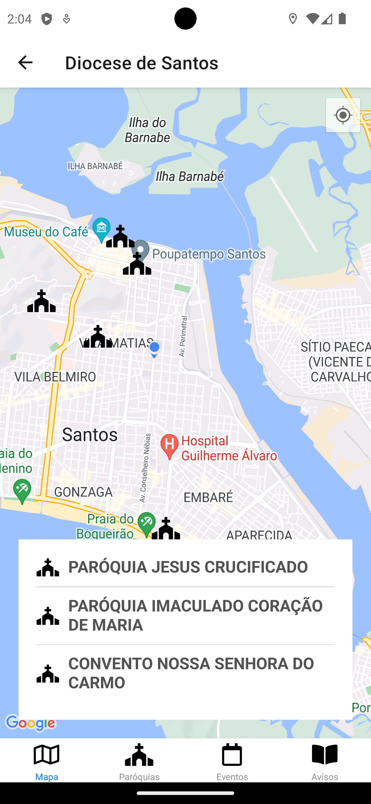

# Diocese de Santos

Aplicativo da Diocese de Santos com as paróquias mais perto de você, avisos e eventos. Feito como projeto da Unisantos.

# Link Importantes
- ORG do projeto: [Diocese Santos - ORG](https://github.com/diocese-santos-org)
- Front-End do projeto: [Diocese Santos - Wiki](https://github.com/diocese-santos-org/diocese-santos-wiki/wiki)
- Back-End do projeto: [Diocese Santos - Back-End](https://github.com/diocese-santos-org/diocese-santos-backend)

## Integrantes
> - Carlos Eduardo Lorenzetti Júnior
> - Elián Roventini de Andrade - [Linkedin - Elián Andrade](https://www.linkedin.com/in/elianroventini/)
> - Gabriel Souza Recouso - [Linkedin - Gabriel Recouso](https://www.linkedin.com/in/gabrielrecouso/)
> - Gustavo Lino Barbosa - [Linkedin - Gustavo Barbosa](https://www.linkedin.com/in/gustavobarb/)
> - Lara Iasmine Pedroso Fabiano - [Linkedin - Lara Iasmine](https://www.linkedin.com/in/lara-iasmine-fabiano/)
> - Leonardo Ribeiro Blume - [Linkedin - Leonardo Blume](https://www.linkedin.com/in/leonardo-blume-5484311b5/)
> - Matheus La Scala Candido da Costa - [Linkedin - Matheus La Scala](https://www.linkedin.com/in/matheus-la-scala-1a1b091b0/)
> - Tiago Samuel Sousa dos Santos - [Linkedin - Tiago Samuel](https://www.linkedin.com/in/tiagosts99)


## Índice

- [Recursos](#recursos)
- [Capturas de Tela](#capturas-de-tela)
- [Pré-requisitos](#pré-requisitos)
- [Instalação](#instalação)
- [Uso](#uso)
- [Links Importantes](#links-importantes)

## Recursos

- Mapa com paróquias próximas.
- Lista de paróquias próximas.
- Lista de eventos.
- Lista de avisos.

## Capturas de Tela





## Pré-requisitos

Certifique-se de ter os seguintes itens abaixos estão instalados em sua máquina:

- [Node.js](https://nodejs.org/)
- [Git](https://git-scm.com/downloads)

## Instalação

1. Primeiro, instale o [Git](https://git-scm.com/downloads) e o [Node.js](https://nodejs.org/en/download/) em seu computador.


2. Clone este repositório.
   ```bash
   git clone https://github.com/diocese-santos-org/diocese-santos-front.git
    ```

3. Navegue até o diretório do projeto e instale as dependências com o comando:
    ```bash
    npm install
    ```

4. Crie um arquivo **.env.local** usando como exemplo o [.env.example](./.env.example) com as informações especificadas nele.


5. Usar o backend: Baixar o NGROK extrair e rodar o app gerado.

    Com o terminal do aplicativo rodando, digitar o comando: 
ngrok.exe http 8080

    Após isso, copiar o ip gerado, exemplo:  https://ebfd-2804-431-cfe9-48ed-3d45-c9d5-9851-4cec.ngrok.io

    e colar na variavel do arquivo .env.local: EXPO_PUBLIC_API_URL


## Uso

1. Inicie o servidor de desenvolvimento do Expo com o comando: 
    ```
    npx expo start
    ```
2. Faça download na Play Store ou App Store em seu celular do aplicativo **Expo GO**.

3. Escanear o QR Code que aparecer usando um celular que tenha o **Expo GO** instalado.

4. Aguarde ser buildado por completo o aplicativo.

5. Caso necessário, com o terminal aberto, utilize o comando para recarregar o aplicativo clicando na tecla:
   ```
   r
   ```

    E para visualizar as requisições, abrir: http://localhost:4040
6. Agora você pode utilizar a Diocese Santos!

### Links Importantes
- WIKI do projeto: https://github.com/diocese-santos-org/diocese-santos-wiki/wiki
- Back-End do projeto: https://github.com/diocese-santos-org/diocese-santos-backend
